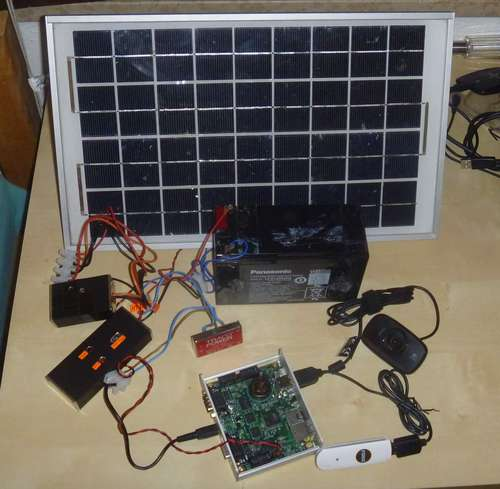

--- 
title: The Kippencam --- starting a new project
kind: article
category: Kippycam
created_at: 04 Jun 2012
summary: "I am starting a new project: a solar-powered webcam in the chicken coop."
---

I have started a new project: I want to make a webcam in the chicken coop. The poor chickens are out there all day, out of sight of the house. And when we're away, it would be good to be able to check on them now and then, and make sure that they're not getting up to any mischief. Wouldn't it be cool to be able to snap pictures when they're up to no good (like eating that mouse they found, or jumping over the fence, again....)? And it would be a great step towards all kinds of cool automation projects, starting with automatic door closing at night.

Requirements
============

- To be self-powered: no running power lines through the garden
- Wireless connection to the house: no running ethernet cables either
- At least one webcam, preferably HDTV quality, preferably extension to 3 cameras to be possible in the future
- Reasonably self-managing and low-maintenance
- Low cost: we're getting married this year

# Inspiration #

The main idea for this project came from "[How to set up a solar powered webcam server using NanosG20 running Debian][NanosCam]" by Janisalnis on instructables. 

Building from this idea, janisalnis already makes the recommendation that modern routers are [a much smarter way to go][salnis-router]. And on [his homepage][salnis-home] there are many examples of the results of his great projects. There, he links [a presentation that really drew my attention][salnis-pres]. He is a really creative guy!

On one slide, he refers to the TP-LINK WR703N, a small router with less than 1W power consumption, yet quite a powerful CPU and USB 2.0! He already refers to a list of possibilities, like HD webcams, USB audio and Arduino linking. Cool stuff! Shockingly enough, these powerful machines sell on ebay for less than EUR20 !!

And I have played with OpenWRT before, so this is starting to look like a great thing. The first two TL-WR703N's have been ordered, cannot wait for them to get here from Hong Kong!

*UPDATE*: I later learned that there is a slightly larger, but largely similar router that can be bought in Europe for a bit more money (but without the long wait): the TL-MR3020. I already had my orders for the smaller one in, but maybe it can be an option for later.

# Research #

## Some reading on the TL-WR703N ##

1. [OpenWRT wiki with all kinds of hardware details][wr703-wiki]
2. [Another wiki page with the related and very similar router MR3020][mr3020-wiki]
3. [A forum discussion that shows how to do I2C with the WR703N][wr703-i2c]. This means that we can control all kinds of hardware without messy Arduino links. I am definitely going to try this.
4. [Loads of instructables presentations by janisalnis that include a plethora of step-by-step guides on everything from hardware to software.][salnis-instr]
5. [A great introduction into the fun of the TL-WR703N by the Embedded Times.][wr703-embtimes]
6. [A slightly messy piece in the OpenWRT wiki on I2C][i2c-wiki]
7. [A Finnish site that mentions the external antenna: This is something I will need to do.][laakkonen]
8. [Forum entry that details the external antenna method][wr703-extant]
9. [If I manage to screw up the firmware, we may need this to recover (serial port)][wr703-serial]
10. On [hackup.net](http://www.hackup.net), there are some nice articles about using OpenWRT for controlling hardware. [This article details one way to use a USB stick for storage, and installing Ruby (without serial support)][hackup-ruby]
11. [A great writeup on adding extra internal usb ports][wr703-usbhub]. I will probably just go with an external hub. Why squeeze everything into a small space for this project?
12. [A detailed list of stuff on hardware control using the WR703N, including Arduino connection and cross-compiling][wr703-ace]
13. [A writeup of getting usb audio to work (cool)][wr703-audio]

## Wireless connection ##

The chicken coop is located in the garden behind my house. This could be ~50 meters from the current location of the main wireless router. Also, the signal needs to pass through several brick walls. All in all, there is no chance that we will have a connection using any simple method. Indeed, even my MacBook (which has a great antenna) does not get a connection in most of the garden. 

So how to get this to work? I will probably add a cantenna to the WR703 in the garden to get good reception and either move the main wireless router to a better location (the attic?) or set up a repeater somewhere in the house, possibly also with a cantenna. This will take some experimentation.

1. 

## Solar powering ##

For the start of the project, I will go with direct solar powering from the panels. No storage. Once the principle has been proven, I will be charging a battery. I did some research on Open Source solar charge controller projects with the idea of making my own charger. While there are some very nice designs around, I really prefer to go with a proven technology. I want the development of the camera to be the fun part, not the screwing with a battery charger. Ultimate efficiency is also not a parameter for me, so I will probably go with either one of these 2 options:

1. Steca SOLSUM 6.6F ([from Conrad probably][conrad-solsum])

2. MorningStar SHS6 ([probably from Sunnyside on Marktplaats][sunnyside])

And realistically, at around EUR 20 a piece, there is not a lot to lose.

Solar panel prices have dropped a lot recently. The cheap made-in-China panels are dropping close to the EUR 1 per Watt-peak mark at the moment. Of course, I have learned from reading, that the cheap suppliers can be quite optimistic regarding their specified Watt-peak values. So in fact the more expensive panels from 'real' manufacturers are supposed to be worth the extra cash. For me, a factor was the availability of reasonably priced small panels on the [Ebay](http://www.ebay.de) was good. I purchased 2x 30W panels from [Enjoy Solar in Bremen][enjoysolar], and will see how they perform. **NOTE:** There seem to be many sellers on ebay that do get very good reviews, but also rack up significant negative comments. Be sure to check the negative comments for a seller before you buy. I nearly fell for a promising-looking seller, which clearly does not take after-sales care as seriously as any (German!) seller should...

## OpenWRT ##

1. [How to use an external USB stick as root filesystem][openwrt-eftroot]. I'm not sure how this could affect flash wear: at the moment I will use a cheap memory stick and just see what happens.
2. [How to enable USB storage, including how to format the partitions for efficiency.][openwrt-usbstor]
3. [A very concise list of instructions to get a WR703N up and going][minipwner]. Probably not going to use, because it avoids USB stick usage, and why would I?
4. [Janisalnis' short description of installing OpenWRT onto a USB stick: a useful start.][salnis-openwrt-usb]

[NanosCam]: <http://www.instructables.com/id/How-to-set-up-a-solar-powered-webcam-server-using-/>
[salnis-router]: http://www.instructables.com/id/How-to-set-up-home-data-server-using-OpenWRT-on-Li/
[salnis-home]: http://barbara320.gotdns.com/
[salnis-pres]: http://www.slideshare.net/JanisAlnis/home-automation-12979616
[wr703-wiki]: http://wiki.openwrt.org/toh/tp-link/tl-wr703n
[mr3020-wiki]: http://wiki.openwrt.org/toh/tp-link/tl-mr3020
[wr703-i2c]: https://forum.openwrt.org/viewtopic.php?id=36471
[salnis-instr]: http://www.instructables.com/member/janisalnis/
[wr703-embtimes]: http://embeddedtimes.blogspot.nl/2011/09/tp-link-tl-wr703n-tiny-linux-capable.html
[i2c-wiki]: http://wiki.openwrt.org/doku.php?id=oldwiki:port.i2c
[laakkonen]: http://laakkonen.dy.fi/projektit/tl-wr703n/
[wr703-extant]: https://forum.openwrt.org/viewtopic.php?id=34580
[wr703-serial]: http://wiki.villagetelco.org/index.php?title=Building_a_Serial_Port_for_TL-WR703N
[hackup-ruby]: http://www.hackup.net/2012/01/openwrt-and-scripting-languages-part-1/#more-358
[wr703-usbhub]: https://forum.openwrt.org/viewtopic.php?pid=156142
[wr703-ace]: http://wiki.acemonstertoys.org/Tp-link_router
[wr703-audio]: https://forum.openwrt.org/viewtopic.php?pid=125196#p125196
[openwrt-extroot]:  http://wiki.openwrt.org/doc/howto/extroot
[openwrt-usbstor]: http://wiki.openwrt.org/doc/howto/usb.storage
[minipwner]: http://www.minipwner.com/index.php/minipwner-build
[salnis-openwrt-usb]: http://www.instructables.com/files/orig/F0M/V4MW/H2MYLKL9/F0MV4MWH2MYLKL9.txt
[conrad-solsum]: http://www.conrad.nl/ce/nl/product/110678?WT.mc_id=mpfeed&insert=8T
[sunnyside]: http://hobby.marktplaats.nl/elektronica-componenten/544588648-steca-en-morningstar-laadregelaars-accu-zonnepaneel.html?return=eJwljEsKwzAMRO8SSJb%2BNF0UB1PSm5jYxSb%2BiEihpaV3r0JW8540jDPafJNRExp9vZkOg9uWOEUiMFKuDUIVxW0rQXaOUNQsz4qACPd3tnrwaKn149yPD5%2FOzMT5ScCIT48smhGOq2Io%2FJjrXsKWFtb1xYot417YGh4jlwFgt2ogtLqbfn%2FEGzUB&df=1&fta=eNpFkEluwzAMRe%2BihdcaPVDwFXoFg4rsVKgcC6GcCA1y98pG0e4eOP0HInTwIuiB7fc4PTASswSdBFbiKBpPY97A%2BgA2ZvgOydLiCYRNGbhdE9z2db6Hi%2F16Am2R9tVuFEA2Ke0jbzKN4ringSW8zsyGukqggAV%2FBgnRAlPOaY%2B6LxUUN0NXpOi9QrdU6BwXvS6St9pw1deKM4tCc4CuI0MF7YWY64wY3CCxLX8HJfetMgordOai2v%2BIM7x65C2hpynOt2v%2BPPxkbQzAVizToVwt%2FelcP4JPZj9%2B8cEsAofX%2B%2F0DyKNhYA%3D%3D&fta_ind=12&fs=1
[enjoysolar]: http://myworld.ebay.de/enjoysolarshop/