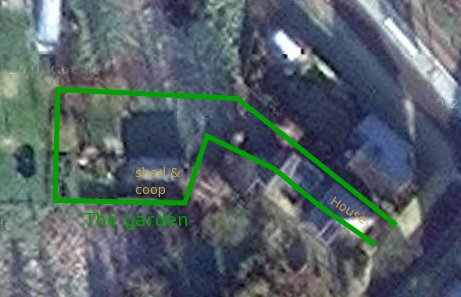

--- 
title: Getting network access in the garden
kind: article
category: Kippycam 
created_at: 22 Jun 2012
summary: "It took quite some work to get a network connection in the garden. How did I manage?"
---

# The problem #

The garden is quite long and goes around a bend. The house has an extension towards the back that blocks most lines of sight between the garden and the main house. Also, the distance from the services entry point and the shed where the chickens live, runs in the tens of meters. Here's an overview of the situation:

The best way would be to dig a pipe through the garden and wire with ethernet. But this would involve digging up 20 meters of paving, and 20 meters of grass. Although it needs to be done some day (to get water and electricity in the garden, for one thing), now is not the time. So --- wireless is the way to go!

# Layout #

To get a wifi signal at the shed, the existing infrastructure in the house is insufficient. It only reaches roughly 10 meters into the garden. Too many walls, too many trees and leaves. 

An extra access  point is needed. In the first place I will create a wireless repeater, because this has worked before. Later, I may relocate the repeater to a place where I can reach it with Ethernet: that would be a more elegant solution in the long run.

**TODO**: Research [Railroad](http://www.rubyinside.com/ruby-graphviz-data-visualization-1477.html) for creating really nice plots.

The ouline is as follows:

	Main Router  ==>	Repeater	==>		Webcam server
	Airport		 	TL-WR703N			TL-WR703N
	DHCP server		relay wlan-wlan			relay wlan-lan

# OpenWRT configuration #

## Repeater ##

I used the `luci` webinterface to configure relaying. Setting this up goes something like this:

    opkg update
    opkg install luci luci-proto-relay
  	# this auto-installs many dependencies, including relayd and uhttpd
  	/etc/init.d/uhttpd enable
  	/etc/init.d/uhttpd start
  	/etc/init.d/relayd enable		# This is required in trunk versions
	
Then, `luci` should be up and running by sending the browser to the router's IP address (most likely `192.168.1.1`). 

A reasonably clear guide to configuring relaying through `luci` is given on [this page at gateworks.com][gateworks]. Only trouble is, that this example is for relaying between `lan` and `wwan`. I started ambitiously, trying to relay to both `lan` and a new `wifi AP`, but this stranded in the complications of it. Start easy.
Also disable security first. This cost me an afternoon, because `psk2` and the `auto` cypher setting were not playing nicely with OS X.

TODO: Add my own nice pictures of how wifi relaying works.

Another place to check for instructions is [In the forums](https://forum.openwrt.org/viewtopic.php?pid=163262#p163262), but be careful. For one, the `trunk` releases need an additional `/etc/init.d/relayd enable`. Also, some of the `wireless` settings are outdated. The essence is good.

Something very confusing is the IP address choice for the interface that is not directly connected to the 'live' network. So the 'access point' network in this case. It gets a static address by definition, but this address is largely ignored. Actually, the relayd passes all traffic from the outside network to the internal network. This includes DHCP requests, which also get passed on and get answered by the Main Router. So in fact all clients on both sides of the relay use IP addresses from the Main Router's subnet. Setting the IP address of the 'inside' network to a different subnet helps in case the 'outside' network is unavailable or does not provide DHCP. Then, we need this 'inside' subnet in order to gain access to the router.

## Webcam server ##

The webcam server follows [the instructions at gateworks.com][gateworks] mostly literally. I kept the `lan` IP at `192.168.1.1`, simply because there was no real reason to change it. Relay is overkill here, but I chose it because it allows any potential clients on the `LAN` interface (wired clients) to join in the network as if nothing was in between. 

TODO: Add description of mjpg-server in additional page and link here

[gateworks]: http://trac.gateworks.com/wiki/relayd

# Physical network #

The wireless repeater helps bridging the distance between the house and the shed, but it does rely on 'line of sight'. And even with a clear line of sight (which I do not have, there are tree leaves and a roof partially in the way), the distance is still significant. I took several steps that I intend to document separately:

1. Convert the TL-WR703N routers to add external antenna connectors.
2. Construct `cantennas` to have better gain and a more efficient (narrower) beam.
3. Place the antennas where there is optimal line of sight

At present, this is enough to cover my needs with limited bandwidth, but acceptable reliability. After researching a bit, cantennas seem to be over-hyped. Maybe I will build yagi or other high gain antennas at a later date. For now, the cans are working.
